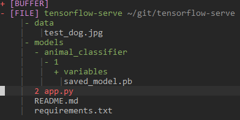

# Tensorflow Serve

Tensorflow serve is a tool that allow us to deploy tensorflow models in the server. Here, we will discuss the easiest way to get started with the tensorflow serve using docker.
This repository takes inspiration from the coursera's MLOps course Deploying Machine Learning Models in Production part 4.

## Pull the docker image

```
docker pull tensorflow/serving
```

## Download Pretrained Models
Download pretrained models and save it inside model folder

```
wget -q -P model/ https://storage.googleapis.com/mlep-public/course_1/week2/model-augmented/saved_model.pb
wget -q -P model/variables/ https://storage.googleapis.com/mlep-public/course_1/week2/model-augmented/variables/variables.data-00000-of-00001
wget -q -P model/variables/ https://storage.googleapis.com/mlep-public/course_1/week2/model-augmented/variables/variables.index
```

## Install the requirements

```
pip install -r requirements.txt
```

## Running the model
```
docker run --rm -p 8501:8501 \
    --mount type=bind,\
    source=<absolute path of the model in the host>,\
    target=<destination path>\
    -e MODEL_NAME=<model_name> -t <tag_name>

```

More specific command
```
 run --rm -p 8501:8501 --mount type=bind,source=/home/siddhi/git/tensorflow-serve/models,target=/models/ -e MODEL_NAME=animal_classifier -t tensorflow/serving
```

After you run the tensorflow serving server, now we run the actual client program `main.py`

<strong>NOTE: </strong> you might want to change the paths. This is what my directory structure looks like:



```
python main.py data/test_dog.jpg  

>>>The predicted class is: dog 
```
